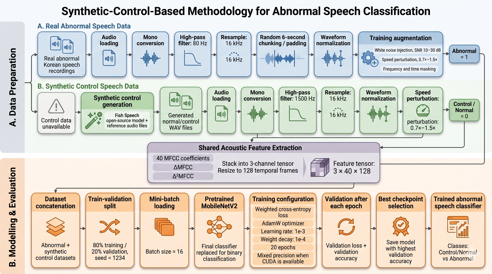

# Abnormal Speech Classification with Synthetic Controls

Binary classification of Korean abnormal speech, trained against a synthetically generated control class. The control side of the dataset does not exist as real recordings, so it is produced with an open-source TTS model (Fish Speech) and put through a parallel preprocessing pipeline. A MobileNetV2 classifier is trained on stacked MFCC features over the combined dataset.

> **Status: work in progress.** This repository contains the data and training pipeline. Evaluation results are not yet reported here.

## The problem

For this task only abnormal speech recordings are available. There is no matched corpus of healthy or normal speech from comparable speakers, so a conventional supervised binary classifier cannot be trained directly.

The methodology side-steps the missing-class problem by generating control samples with a TTS model and treating those as the normal class. The classifier then learns to separate real abnormal speech from synthesised normal speech, using MFCC-based features that are computed identically on both sides.

## Pipeline



The pipeline has two parallel data preparation tracks that converge at a shared acoustic feature extraction stage, followed by a single training and evaluation loop.

### A. Real abnormal speech (label = 1)

Real Korean abnormal speech recordings go through:

1. Audio loading
2. Mono conversion
3. High-pass filter at 80 Hz (removes DC offset, breath rumble, room noise)
4. Resample to 16 kHz
5. Random 6-second chunking or padding
6. Waveform normalisation
7. Training-time augmentation:
   * White noise injection at SNR 10 to 30 dB
   * Speed perturbation 0.7x to 1.5x
   * Frequency masking and time masking (SpecAugment-style)

Implemented in `dataset.py`.

### B. Synthetic control speech (label = 0)

Since no real control data is available, the normal class is built from scratch:

1. **Synthetic control generation** using the Fish Speech open-source TTS model conditioned on reference audio files. Produces WAV files of normal Korean speech.
2. Audio loading
3. Mono conversion
4. High-pass filter at 1500 Hz
5. Resample to 16 kHz
6. Waveform normalisation
7. Speed perturbation 0.7x to 1.5x

Implemented in `dataset_control.py`.

The 1500 Hz high-pass on the synthetic track is deliberately more aggressive than the 80 Hz cutoff on the real track. The intent is to discourage the classifier from exploiting low-frequency TTS-versus-recording cues (room tone, microphone characteristics, vocoder rumble) and to push it toward higher-frequency content where speech articulation lives.

### Shared acoustic features

Both tracks land in the same feature extractor:

* 40 MFCC coefficients
* First-order deltas (`ΔMFCC`)
* Second-order deltas (`Δ²MFCC`)

The three feature streams are stacked into a 3-channel tensor and resized to 128 temporal frames. Final tensor shape per sample: `3 x 40 x 128`. This matches the input layout that an ImageNet-pretrained MobileNetV2 expects, which is what makes the next step possible.

## Model and training

A MobileNetV2 pretrained on ImageNet, with its final classification head replaced by a two-class linear layer. The 3-channel MFCC tensor is fed in the same way a natural image would be, so the pretrained convolutional backbone is reused as a general 2D pattern extractor over the time-frequency plane.

| Setting | Value |
|---|---|
| Backbone | MobileNetV2 (ImageNet pretrained, classifier replaced) |
| Loss | Weighted cross-entropy |
| Optimiser | AdamW |
| Learning rate | 1e-3 |
| Weight decay | 1e-4 |
| Batch size | 16 |
| Epochs | 20 |
| Train / validation split | 80 / 20 (seed = 1234) |
| Mixed precision | Enabled when CUDA is available |
| Checkpointing | Best model by validation accuracy |

Implemented in `train.py`. Evaluation logic lives in `eval.py`.

## Repository structure

```
abnormal-speech-classifier/
├── dataset.py           # real abnormal speech dataset + augmentation
├── dataset_control.py   # synthetic control generation + preprocessing
├── train.py             # training loop, val-after-epoch, best-checkpoint logic
├── eval.py              # evaluation on held-out data
├── utils.py             # shared helpers (feature extraction, IO, logging)
├── docs/
│   └── method.png       # pipeline figure
└── README.md
```

## Setup

Core dependencies: `torch`, `torchvision`, `torchaudio`, `librosa`, `numpy`, `scipy`, `tqdm`. The synthetic control track also needs Fish Speech and its model weights, installed separately per the upstream instructions.

## Usage

### Train

```bash
python train.py \
    --abnormal-root  data/abnormal/ \
    --control-root   data/synthetic_control/ \
    --epochs         20 \
    --batch-size     16 \
    --lr             1e-3 \
    --weight-decay   1e-4 \
    --seed           1234 \
    --output         checkpoints/
```

The trainer concatenates the abnormal and synthetic control datasets, applies the 80 / 20 split, runs validation after every epoch, and saves the checkpoint with the highest validation accuracy.

### Evaluate

```bash
python eval.py \
    --checkpoint  checkpoints/best.pt \
    --data        data/test/
```

## Notes on the synthetic control design

A few design decisions are worth being explicit about:

* **Filter asymmetry is intentional.** Different high-pass cutoffs on the two tracks are there to suppress low-frequency channel cues that would otherwise let the classifier separate the classes without ever modelling speech.
* **Augmentation asymmetry is also intentional.** The real abnormal track gets noise injection and SpecAugment in addition to speed perturbation, since the abnormal recordings are sparse and need stronger regularisation. The synthetic control track gets only speed perturbation, since the upstream TTS can be re-sampled to produce additional variety if needed.
* **MobileNetV2 over a custom 1D backbone** is a deliberate choice for reuse: the 3-channel `MFCC / deltaMFCC / delta2MFCC` stack maps cleanly to image-style input, so the ImageNet-pretrained weights provide a useful starting point with no extra pretraining cost.
